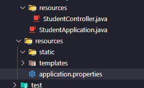
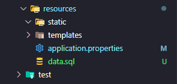

# Projeto Java Spring ☕

# Aula 01 - 07/05 📝

## Extensões do VSCode

> Extension Pack for Java
> Spring Boot Extension Pack

## Iniciando um projeto Spring

abra o vscode
digite ctrl + shift + P
digite spring initialize

[Spring](start.spring.io)

Project:

> Maven

Language:

> Java

Spring Boot:

> 3.2.5

Packaging:

> Jar

Java:

> 17

Dependecies:

> Spring web
> Spring boot devtools
> Spring Data JPA
> H2 Database

## Inicie o projeto

Abra a pasta raiz do projeto
Add git init
adcione as alterações e suba o primeiro commit

## Cire um resources dentro de students

Classe StudentController.java

Adicione a anotação

```java
@RestController
@RequestMapping("students")
```

Crie dentro dela um método helloStudent() para testar

```java
public String helloStudent(){
    return "Hello from Student COntroller";
}
```

Remova esse método e sua importação

Crie dentro da pasta students tbm uma pasta entities

## Crie uma Classe Student.java

Crie os atributos do estudante

```java
private Integer id;
private String name;
private String course;
```

## Crie os getters e setters deles

Va na classe StudentController e crie um método Student getStudent()
adicione a anotação

> @GetMapping

Construa um objeto dentro dela

```java
Student s = new Student();
```

adicione cada um dos atributos do objeto:

```java
s.setName("Gustavo Ferreira");
s.setId(1);
s.setCourse("Engenharia da Computação");
```

altere o método getStudent para getStudents
altere o tipo para LIst<Student>

Irá ficar assim:

```java
@GetMapping
public List<Student> getStudents() {

    Student s1 = new Student();
    Student s2 = new Student();
    Student s3 = new Student();

    s1.setId(1);
    s1.setName("Gustavo Ferreira");
    s1.setCourse("Engenharia da Computação");

    s2.setId(2);
    s2.setName("Gabriel da Silva");
    s2.setCourse("Análise e Desenvolvimento de Sistemas");

    s3.setId(1);
    s3.setName("Ricardo Toiobo");
    s3.setCourse("Gestão de Tecnologia da Informação");

    ArrayList<Student> lista = new ArrayList<Student>();
    lista.add(s1);
    lista.add(s2);
    lista.add(s3);
    return lista;

}
```

# Aula 02 - 14/05 📝

## Mapeamento Objeto Relacional

> Integrando o JPA ao projeto

Adicione o mapeamento na classe Student

> @Entity
> @Table(name = "TBL_STUDENT")

Importe o jakarta.persistence

Adicione para no atributo id as anotações:

> @Id
> @GeneratedValue(strategy = GenerationType.AUTO)

Adicione para o atributo name a anotação:

> @Column(length = 40)

Ficando exatamente assim:

```java
@Entity
@Table(name = "TBL_STUDENT")
public class Student {
    @Id
    @GeneratedValue(strategy = GenerationType.AUTO)
    private Integer id;

    @Column(length = 40)
    private String name;

    private String course;

    public Integer getId() {
        return id;
    }

    public void setId(Integer id) {
        this.id = id;
    }

    public String getName() {
        return name;
    }

    public void setName(String name) {
        this.name = name;
    }

    public String getCourse() {
        return course;
    }

    public void setCourse(String course) {
        this.course = course;
    }
}
```

## Adicionando o banco de dados

Vá para properties:



Insira os dados de login do banco:

```java
spring.datasource.url=jdbc:h2:mem:testdb
spring.datasource.username=sa
spring.datasource.password=
```

Salve as alterações e acesse o console do banco de dados:
[Clique aqui!](http://localhost:8080/h2-console)

## Inserindo os dados no banco

Crie um arquivo dentro de resources

```
data.sql
```



Insira os dados da tabela de estudantes:

```sql
INSERT INTO TBL_STUDENT(NAME, COURSE) VALUES ("Gustavo Ferreira","Engenharia da Computação");
INSERT INTO TBL_STUDENT(NAME, COURSE) VALUES ("Gabriel da Silva","Análise e Desenvolvimento de Sistemas");
INSERT INTO TBL_STUDENT(NAME, COURSE) VALUES ("Ricardo Toiobo","Gestão de Tecnologia da Informação");
```

Ao depurar irá dar um erro pois sua tabela ainda não existe

Crie uma pasta repositories

Crie um arquivo SudentRepository.java que será uma interface que herda a interface JpaRepository<Student,Integer>

```java
public interface StudentRepository extends JpaRepository<Student,Integer>{

}
```

Importe os pacotes:

```java
import org.springframework.data.jpa.repository.JpaRepository;
import com.fatec.student.entities.Student;
```

Altere o Student.java a anotação

```java
@GeneratedValue(strategy = GenerationType.AUTO)
```

para

```java
@GeneratedValue(strategy = GenerationType.IDENTITY)
```

Adicione a inicialização do banco de dados e os caracteres pt-br em resorces/aplication.properties:

```java
spring.jpa.defer-datasource-initialization=true
spring.sql.init.encoding=UTF-8
```

## Criando os services

Crie uma pasta services dentro de student
Crie um arquivo StudentService.java

Insira a anotação Service e seu pacote

```java
import org.springframework.stereotype.Service;

@Service
public class StudentService {

}
```

## Injeção de Dependência

Inserindo a injeção de Dependência e a inversão de controle

```java
@Autowired
    private StudentRepository studentRepository;
```

importe os packages deles

insira a lista de students:

```java
public List<Student>getStudents(){
        return studentRepository.findAll();

    }
```

Vá para os serviços e remova os objetos criados, inserindo as anotações que buscam os dados do banco de dados:

```java
@RestController
@RequestMapping("students")
public class StudentController {

    @Autowired
    private StudentService studentService;

    @GetMapping
    public List<Student> getStudents(){
        return studentService.getStudents();
    }
}
```

# Aula 03 - 21/05

## End Points

### Buscar estudante por ID

Para devolver um estudante por ID será necessario buscar no serviço o metodo getStudentById() dentro da class Student Service. Ficará assim:

```java
public Student getStudentById(int id){

    }
```

Dentro dele é necessario que seja retornado um objeto do tipo estudante. Caso não seja encontrado retorne uma excessão

```java
return studentRepository.findById(id).orElseThrow(
            ()-> new EntityNotFoundException("Aluno não cadastrado")
        );
```

Ficando exatamente assim:

```java
@Service
public class StudentService {
    @Autowired
    private StudentRepository studentRepository;

    public List<Student>getStudents(){
        return studentRepository.findAll();
    }

    public Student getStudentById(int id){
        return studentRepository.findById(id).orElseThrow(
            ()-> new EntityNotFoundException("Aluno não cadastrado")
        );
    }
}
```

Volte para o Controlador e crie um mapeamento que recupera o estudante pelo seu ID. Mas precisa ter uma anotação: @GetMapping("{id}").

Crie um metodo com o pathvariable para pegar o valor do serviço irá para a variavel id.

```java
@GetMapping("{id}")
    public Student getStudentById(@PathVariable int id){
    }
```

Dentro dela retorna getStudentById(id) através do serviço. Ficando assim:

```java
    @GetMapping("{id}")
    public Student getStudentById(@PathVariable int id){
        return studentService.getStudentById(id);
    }
```

### Remover um estudante

Para remover um estudante também será necessario criar um metodo dento da classe Controladora sem um retorno:

```java
public void deleteStudentByID(int id){
    }
```

Dentro dele é necessario buscar o id, removendo do banco e criar uma excessão caso não seja encontrado. Ficando exatamente assim:

```java
public void deleteStudentByID(int id){
        if(this.studentRepository.existsById(id)){
            this.studentRepository.deleteById(id);
        }
        else{
            throw new EntityNotFoundException("Aluno não cadastrado")/
        }
    }
```

Volte para o Controlador e crie um mapeamento sem retorno que busque o estudante pelo seu ID. Mas precisa ter a anotação de remoção: @DeleteMapping("{id}").

Crie um metodo com o pathvariable para pegar o valor do serviço irá para a variavel id.

```java
@DeleteMapping("{id}")
    public void deleteStudentById(@PathVariable int id){
    }
```

Dentro dela crie sem retorno o deleteStudentById(id) através do serviço. Ficando assim:

```java
    @DeleteMapping("{id}")
    public void deleteStudentById(@PathVariable int id){
        this.studentService.deleteStudentById(id);
    }
```

### Inserir um novo estudante

Para inserir um estudante será necessario criar um metodo save dento da classe Controladora:

```java
public Student save(Student student){

}
```

Dentro dele insere um novo objeto do tipo estudante com o metodo save. Ficando exatamente assim:

```java
public Student save(Student student){
        return this.studentRepository.save(student);
    }
}
```

Volte para o controlador e insira uma anotação PostMapping e insira o metodo save do tipo estudante, retornando o próprio estudante:

```java
@PostMapping
    public Student save(Student student){
        return this.studentService.save(student);
    }
```

O HTTP Tem o Header e Body tanto para o request quanto o response. A anotação RequestBody pega o body do request e coloca dentro do objeto estudante.

```java
@PostMapping
   public Student save(@RequestBody Student student){
       return this.studentService.save(student);
   }
```

### Atualizar um estudante

Para atualizar um estudante será necessario criar um metodo nulo dento da classe Controladora que busque pelo id e o objeto do tipo estudante:

```java
public void updateStudentById(int id, Student student){
    }
```

Crie um try catch para tentar executar algo, caso não seja possivel retorna a excessão. Ficando assim:

```java
public void updateStudentById(int id, Student student){
        try {

        } catch (Exception e) {
            // TODO: handle exception
        }
    }
```

Agora precisamos da referencia. Vamos criar um objeto auxiliar que irá buscar o nome e curso do estudante. Dentro do try iremos tentar capiturar o dado do estudante, caso não seja possivel retorna uma excessão.
Ficando assim:

```java
public void updateStudentById(int id, Student student){
        try {
            Student aux = studentRepository.getReferenceById(id);
            aux.setCourse(student.getCourse());
            aux.setName(student.getName());
            this.studentRepository.save(aux);

        } catch (Exception e) {
           throw new EntityNotFoundException("Aluno não encontrado");
        }
    }
```

próxima aula iremos inserir o put dentor do controlador para atualizar os dados do aluno.

# Aula 04 - 28/05

## End Points pt.2

### Atualizar um estudante

Volte para o controlador e insira uma anotação PutMapping e insira o metodo update sem retorno do tipo estudante, retornando o updateStudentByID, ficando exatamente assim:

~~~java
@PutMapping("{id}")
public void update(@PathVariable int id, @RequestBody Student student){
    this.studentService.updateStudentById(id, student);
}
~~~
### Tratamento os Status Code
Para cada chamada para um end point deverá devolver um status code do HTTP correto. Iremos aplicar para cada dos metodos do controlador extamente esses status.

#### Status Code do GetStudents
Para o GetStudents necessita um ResponseEntity em uma lista de objetos Student retornando um ResponseEntity Ok para o metodo getStudents. Atualizaremos o getStudents para o seguinte metodo:
~~~java
@GetMapping
    public ResponseEntity<List<Student>> getStudents(){
        return ResponseEntity.ok(studentService.getStudents());
    }
~~~
#### Status Code do GetStudentById
Para o GetStudents necessita um ResponseEntity do objeto Student retornando um ResponseEntity Ok para o metodo getStudentById. Atualizaremos o getStudentById para o seguinte metodo:
~~~java
@GetMapping("{id}")
public ResponseEntity<Student> getStudentById(@PathVariable int id){
    return ResponseEntity.ok(studentService.getStudentById(id));
}
~~~
#### Status Code do deleteStudentById
Para o GetStudents necessita um ResponseEntity do objeto nulo <Void> retornando um ResponseEntity noContent e o build por se tratar de não possuir um retorno do objeto. Atualizaremos o deleteSudentById para o seguinte metodo:
~~~java
@DeleteMapping("{id}")
    public ResponseEntity<Void> deleteStudentById(@PathVariable int id){
        this.studentService.deleteStudentById(id);
        return ResponseEntity.noContent().build();
    }
~~~
#### Status Code do save
Para o GetStudents necessita um ResponseEntity do objeto Student retornando um ResponseEntity Ok para o metodo save. Atualizaremos o save para o seguinte metodo:
~~~java
    @PostMapping
    public ResponseEntity<Student> save(@RequestBody Student student){
        return ResponseEntity.ok(studentService.save(student));
    }
~~~
#### Status COde do update
Da mesma forma que o metodo deleteStudentById o update não possui retorno do objeto. Nesse caso tambem aplicamos um objeto <Void> retornando um ResponseEntity noContent e um build também. Atualizaremos o update para o seguinte método:
~~~java
    @PutMapping("{id}")
    public ResponseEntity<Void> update(@PathVariable int id, @RequestBody Student student){
        this.studentService.updateStudentById(id, student);
        return ResponseEntity.noContent().build();
    }
~~~
## Exceptions
Iremos criar uma classe global para capitar uma das diversas excessões. 
Crie uma pasta dentro de resources chamada exceptions. Crie uma classe chamada ResourceExceptionHandler.
A anotação que iremos usar é @ControllerAdvice, que captiura uma excessões lançadas que serão tratadas. No nosso caso a excessão que iremos tratar é a EntityNotFoundException.

### ResoruceExceptionHandler
Crie um metodo que trate uma entre diversas excessões e quando acontecer retorne a excessão 404 not found. Ficando assim:
~~~java
@ControllerAdvice
public class ResourceExceptionHandler {
    public ResponseEntity<Void> entityNotFoundException(){
        return ResponseEntity.notFound().build();
    }
}
~~~
Crie uma anotação do exception Handler para indicar qual excessão será tratada, no caso EntityNotFoundException. 
~~~java
@ExceptionHandler(EntityNotFoundException.class)
~~~

Para pegar a chamada do request teremos que incluir dentro do metodo um entityNotFoundException e um HttpServletRequest. Ficando assim~no geral:
~~~java
@ControllerAdvice
public class ResourceExceptionHandler {
    @ExceptionHandler(EntityNotFoundException.class)
    public ResponseEntity<StandardError> entityNotFoundException(
        EntityNotFoundException e,
        HttpServletRequest request
        ){
        return ResponseEntity.notFound().build();
    }
}
~~~

### StandardError
Crie uma classa StandardError quando for o 404. Iremos guardar o instante em que o erro aconteceu, o seu status, o numero do erro, a mensagem e seu endereço 'path'.
Ficando assim:

~~~java
public class StandardError {    
    private Instant timeStamp;
    private Integer status;
    private String error;
    private String message;
    private String path;
}
~~~
Crie para esses atributos o Getters e Setters para todos. Detalhe é importar o pacote resources.
Ficando a classe completa assim:
~~~java
package com.fatec.student.resources.exceptions;

import java.time.Instant;

public class StandardError {

    private Instant timeStamp;
    private Integer status;
    private String error;
    private String message;
    private String path;
    
    public Instant getTimeStamp() {
        return timeStamp;
    }
    public void setTimeStamp(Instant timeStamp) {
        this.timeStamp = timeStamp;
    }
    public Integer getStatus() {
        return status;
    }
    public void setStatus(Integer status) {
        this.status = status;
    }
    public String getError() {
        return error;
    }
    public void setError(String error) {
        this.error = error;
    }
    public String getMessage() {
        return message;
    }
    public void setMessage(String message) {
        this.message = message;
    }
    public String getPath() {
        return path;
    }
    public void setPath(String path) {
        this.path = path;
    }
}
~~~
Agora devemos vincular a estrutura da classe dentro de ResourceExceptionHandler para cada campo do erro dentro da classe. Volte para a lcasse ResourceExceptionHandler e adicione os erros para cada atributo da classe:
~~~java
error.setStatus(HttpStatus.NOT_FOUND.value());
error.setError("Resource Not Found");
error.setMessage(e.getMessage());
error.setTimeStamp(Instant.now());
error.setPath(request.getRequestURI());
~~~
Altere o retorno da classe ResorceExceptionHandler com o status da excessão e seu devido erro. Ficando a classe completa exatamente assim:
~~~java
@ControllerAdvice
public class ResourceExceptionHandler {

    @ExceptionHandler(EntityNotFoundException.class)
    public ResponseEntity<StandardError> entityNotFoundException(
            EntityNotFoundException e,
            HttpServletRequest request) {

        StandardError error = new StandardError();
        error.setStatus(HttpStatus.NOT_FOUND.value());
        error.setError("Resource Not Found");
        error.setMessage(e.getMessage());
        error.setTimeStamp(Instant.now());
        error.setPath(request.getRequestURI());

        return ResponseEntity.status(HttpStatus.NOT_FOUND).body(error);
    }
}
~~~


